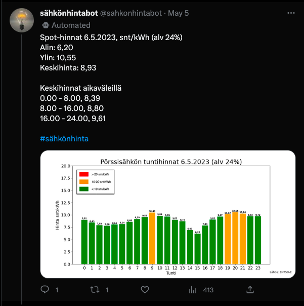
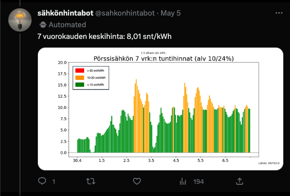
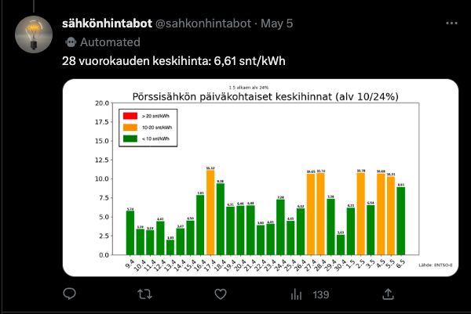

# Sähkönhintabot

[Sähkönhintabot](https://twitter.com/sahkonhintabot) is a Python app that retrieves daily market electricity price data from the ENTSO-E API, generates graphical tweets of the market electricity data using Matplotlib and tweets it out daily.

## Day-Ahead

## 7-day average

## 28-day average

